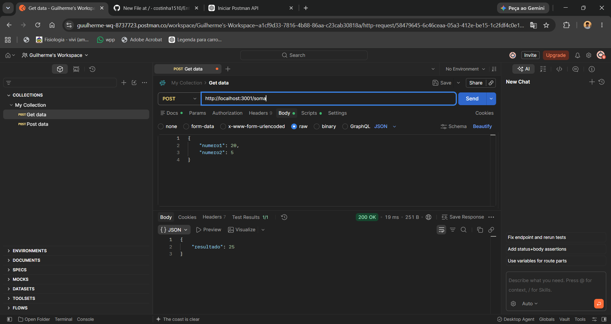

# 🧮 API Calculadora — Node.js e Express

Projeto desenvolvido para criar uma API utilizando **Node.js** e **Express**, permitindo realizar operações matemáticas através de requisições HTTP e testar os resultados utilizando o **Postman**.

Além da API, foi desenvolvido um **frontend** para apresentar uma interface para a calculadora.

## 📌 Funcionalidades

A aplicação possui quatro operações matemáticas:

* ➕ Soma
* ➖ Subtração
* ✖️ Multiplicação
* ➗ Divisão

Cada operação possui uma rota própria na API.

## 🖥️ Frontend

Foi desenvolvido um frontend para a aplicação, proporcionando uma interface visual para utilização da calculadora.

### 📸 Interface da aplicação


## 🛠️ Tecnologias utilizadas

* **Node.js**
* **Express**
* **JavaScript**
* **HTML**
* **CSS**
* **Postman**

## 📂 Estrutura do projeto

```text
Entregavel-3/
│
├── soma.png
├── subtracao.png
├── multiplicacao.png
├── divisao.png
├── app.png
├── index.js
├── package.json
├── package-lock.json
└── README.md
```

## 🚀 Como executar o projeto

### 1. Instalar as dependências

Abra o terminal na pasta do projeto e execute:

```bash
npm install
```

### 2. Iniciar o servidor

```bash
node index.js
```

O servidor será executado na porta **3001**:

```text
http://localhost:3001
```

## 📮 Testando com o Postman

Todas as operações da API são realizadas utilizando o método **POST**.

### ➕ Soma

**Endpoint:**

```text
POST http://localhost:3001/soma
```

**Body → raw → JSON:**

```json
{
    "numero1": 20,
    "numero2": 5
}
```

**Resultado esperado:**

```text
25
```

#### 📸 Evidência no Postman



---

### ➖ Subtração

**Endpoint:**

```text
POST http://localhost:3001/subtracao
```

**Body → raw → JSON:**

```json
{
    "numero1": 20,
    "numero2": 5
}
```

**Resultado esperado:**

```text
15
```

#### 📸 Evidência no Postman


---

### ✖️ Multiplicação

**Endpoint:**

```text
POST http://localhost:3001/multiplicacao
```

**Body → raw → JSON:**

```json
{
    "numero1": 20,
    "numero2": 5
}
```

**Resultado esperado:**

```text
100
```

#### 📸 Evidência no Postman


---

### ➗ Divisão

**Endpoint:**

```text
POST http://localhost:3001/divisao
```

**Body → raw → JSON:**

```json
{
    "numero1": 20,
    "numero2": 5
}
```

**Resultado esperado:**

```text
4
```

#### 📸 Evidência no Postman


---

## 📋 Rotas da API

| Operação         | Método | Endpoint         |
| ---------------- | ------ | ---------------- |
| ➕ Soma           | POST   | `/soma`          |
| ➖ Subtração      | POST   | `/subtracao`     |
| ✖️ Multiplicação | POST   | `/multiplicacao` |
| ➗ Divisão        | POST   | `/divisao`       |

## 🎯 Objetivo

O objetivo deste projeto é desenvolver uma aplicação utilizando **Node.js e Express**, praticando a criação de APIs, rotas HTTP, recebimento de dados em formato JSON e realização de operações matemáticas.

O projeto também inclui uma interface frontend e testes das funcionalidades realizados através do **Postman**, com as respectivas evidências apresentadas neste README.

## 👨‍💻 Autor

**Guilherme Costa**

Projeto acadêmico desenvolvido para fins de estudo.
